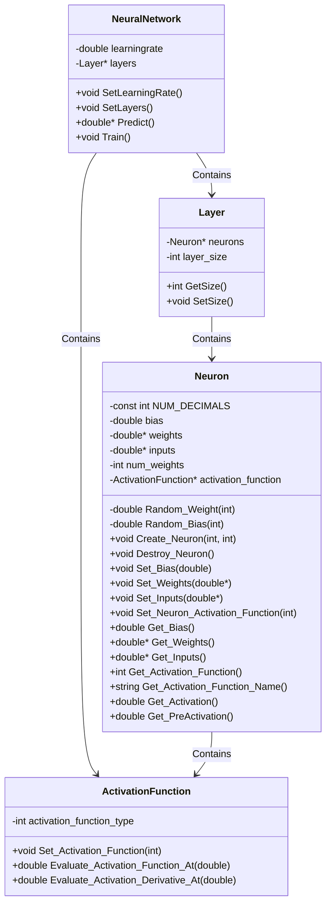

```mermaid
 classDiagram
      
      NeuralNetwork --> Layer : Contains
      Layer --> Neuron : Contains
      NeuralNetwork --> ActivationFunction : Contains
      Neuron --> ActivationFunction : Contains
      
      class NeuralNetwork{
          -double learningrate
          -Layer* layers
          +void SetLearningRate()
          +void SetLayers()
          +double* Predict()
          +void Train()
      }
      
      class Layer{
          -Neuron* neurons
          -int layer_size
          +int GetSize()
          +void SetSize()
      }
      
      class Neuron{
    -const int NUM_DECIMALS
    -double bias
    -double* weights
    -double* inputs
    -int num_weights
    -double Random_Weight(int)
   -double Random_Bias(int)
    -ActivationFunction* activation_function
   
    +void Create_Neuron(int, int)
    +void Destroy_Neuron()
    +void Set_Bias(double)
    +void Set_Weights(double*)
    +void Set_Inputs(double*)
    +void Set_Neuron_Activation_Function(int)
    +double Get_Bias()
    +double* Get_Weights()
    +double* Get_Inputs()
    +int Get_Activation_Function()
    +string Get_Activation_Function_Name()
    +double Get_Activation()
    +double Get_PreActivation()
	  }
      
      
      class ActivationFunction{
          -int activation_function_type
          +void Set_Activation_Function(int)
          +double Evaluate_Activation_Function_At(double)
          +double Evaluate_Activation_Derivative_At(double)
      }
      
```

