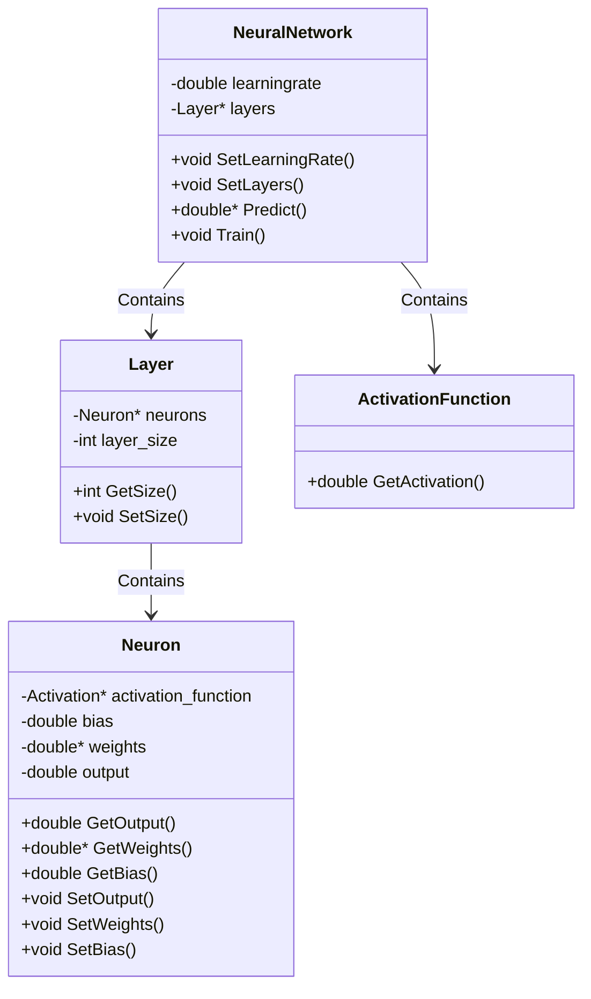

```mermaid
 classDiagram
      
      NeuralNetwork --> Layer : Contains
      Layer --> Neuron : Contains
      NeuralNetwork --> ActivationFunction : Contains
      
      class NeuralNetwork{
          -double learningrate
          -Layer* layers
          +void SetLearningRate()
          +void SetLayers()
          +double* Predict()
          +void Train()
      }
      
      class Layer{
          -Neuron* neurons
          -int layer_size
          +int GetSize()
          +void SetSize()
      }
      
      class Neuron{
      	-Activation* activation_function
        -double bias
        -double* weights
        -double output
        +double GetOutput()
        +double* GetWeights()
        +double GetBias()
        +void SetOutput()
        +void SetWeights()
        +void SetBias()
	  }
      
      
      class ActivationFunction{
          +double GetActivation()
      }
      
```

